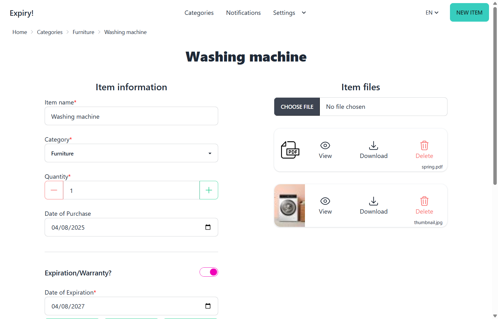

# Expiry
- An application specialized for storing documents digitally, reminding expiring items and ending warranties of consumer
goods.
- Implemented as a part of Jan Kousalík's bachelor thesis (https://dspace.cvut.cz/handle/10467/109564) (written in Czech)
  - More screenshots from the application can be found on page 61 in Annex A

## Abstract of the bachelor thesis
This bachelor thesis focuses on the design and implementation of a prototype
web application called Expiry – an application specialized for storing documents digitally, reminding expiring items and ending warranties of consumer
goods. The prototype was implemented using the PHP language, the Symfony framework and the Hotwire technology, which is, among other things,
thoroughly described in the theoretical part of this thesis.

Before the development of the prototype, an analysis of the needs of the
potential users of this application and a search of already existing applications
that specialize in solving the same problems was carried out. The resulting
prototype was deployed to a remote server and subjected to user testing.

## How to run the app locally
1. Run `docker compose up -d`
2. Open your browser at `localhost:8080`
### Notes
- Email notifications will not work
